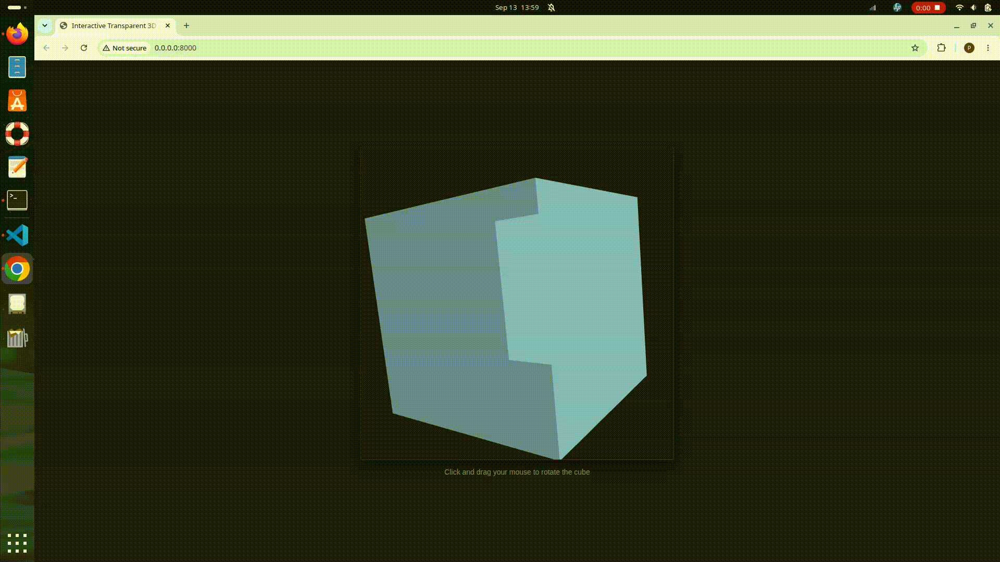

# 3D Cube Using Rust + WebAssembly

A simple interactive 3D cube built with **Rust, WebAssembly, and WebGL**, with mouse-controlled rotation.



## Run Locally

### Prerequisites

* [Rust](https://www.rust-lang.org/)
* [wasm-pack](https://rustwasm.github.io/wasm-pack/)
* Python 3

### 1. Clone the repository

```bash
git clone https://github.com/pratim994/3d-cube-using-rust-and-wasm-.git
cd 3d-cube-using-rust-and-wasm-
```

### 2. Build the WebAssembly package

```bash
wasm-pack build --target web
```

### 3. Start a local server

```bash
python3 -m http.server
```

Then open **http://localhost:8000** in your browser.

> Don't open `index.html` directly with `file://` — the WASM module needs to be served over HTTP.

## Controls

🖱️ **Click and drag** to rotate the cube.

## Tech Stack

* Rust
* WebAssembly
* WebGL
* GLSL

